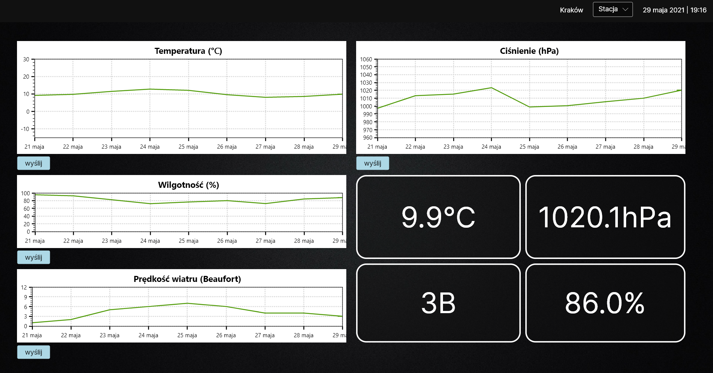

# Pogoda

Pogoda to aplikacja wykonana w ramach praktyk zawodowych przez uczniów krakowskiego Technikum Łączności nr 14.
	Jej zadaniem jest wyświetlanie pobranych z zewnętrznego źródła danych w formie wykresów. Użytkownik ma możliwość
	wyboru spośród 62 stacji meteorologicznych w Polsce. Aplikacja wyświetla dane dotyczące temperatury, ciśnienia,
	prędkości wiatru oraz wilgotności. Poza wykresami, wyświetlane są również dane z ostatniego pomiaru wybranej stacji.
	


## Moduły

### DataService.cs

#### GetWeather()
za pomocą protokołu HTTP pobiera asynchronicznie dane ze strony [danepubliczne.imgw.pl](https://danepubliczne.imgw.pl/) w formacie JSON, który deserializuje na tablicę obiektów klasy *Weather*. Zapisuje dane w zmiennej *DataList*, wyświetla je oraz zwraca

#### DisplayData() oraz DisplayAllData()
wyświetlają w przyjaznej formie wartości właściowości przekazanego obiektu lub tablicy takich obiektów

#### GetWeatherById() oraz GetWeatherByName()
wyszkują i zwracają obiekt klasy *Weather* znaleziony w tablicy *DataList* na podstawie kolejno ID stacji lub jej nazwy. W przypadku niepowodzenia, funkcje zwracają **false**

#### SearchStation()
w przypadku rozwoju aplikacji funkcja ta pozwoli na wyszukiwanie obiektu Weather na podstawie wpisanej frazy

### Database.cs

Serwis przechowuje ścieżkę do pliku z rozszerzeniem json, który służy jako baza danych. Obsługa komunikacji z plikiem jest możliwa dzięki wbudowanemu obiektowi *File*
		
#### Rep()
jako argument przyjmuje zmienną typu string, następnie wszystkie kropki zmienia na przecinki. Jest to niezbędna operacja do konwersji takiego stringa na typ **double**, która następuje. Potem przekonwertowana wartość zostaje zwrócona

#### Initialize()
odpowiada za inicjację bazy danych w przypadku, gdy jej plik jest pusty. Wprowadza dane aktualnie wybranej stacji pogodowej (domyślnie "Kraków")

#### SaveDataToDatabase()
funkcja ta wywoływana jest m.in. po ponownym pobraniu danych z API pogodowego. Wówczas aktualizuje zawartość bazy danych, a gdy baza jest pusta wywołuje funkcję *Initialize*

#### Save()
serializuje przekazaną jako argument listę obiektów klasy *StationMeasurement* oraz zapisuje string bezpośrednio do pliku bazy danych. Po wprowadzeniu danych do bazy, aktualizuje stan wykresów

#### Get()
pobiera i deserializuje dane pobrane z bazy danych oraz je zwraca

### ChartService.cs

Tu przechowywane są dane z ostatniego pomiaru oraz lista wszystkich pomiarów wyświetlanych na wykresach

#### SetMeasurements()
pobiera z bazy danych listę wszystkich pomiarów

#### Render...Chart()
cztery funkcje odpowiedzialne za wygenerowanie wykresów. Model jaki zwracają,
zostaje zbindowany w pliku *ChartsViewModel.cs* z widokiem wykresów. Każda z funkcji pobiera aktualne dane z wybranej stacji, tworzy model, nadaje mu tytuł oraz z pomocą pozostałych funkcji przypisuje wartości do niego

#### AddFunctionSeries()
jako argument przyjmuje listę pomiarów i na jej podstawie generuje obiekt *FunctionSeries*. Do obiektu przypisuje punkty na podstawie daty pomiaru oraz jego wartości, które następnie będą wyświetlane na wykresie. Zwraca obiekt klasy *FunctionSeries*

#### SetDateTimeAxis()
zwraca przygotowaną wcześniej oś X z datami z całego minionego tygodnia
		
#### SetLinearAxis()
ustawia dla modelu oś Y zawierającą wartości generowane na podstawie parametrów (minimalna wartość, maksymalna wartość, odległość między wyświetlanymi na osi wartościami)

### DateService.cs

Przechowuje ostatnio pobraną datę

#### GetDate()
pobiera z API aktualną datę i ją zwraca

### CommunicationService.cs

#### Connect()
jako argument przyjmuje zmienną typu string (wiadomość do wysłania na port szeregowy). Funkcja pobiera i zapisuje do zmiennej nazwy wszystkich dostępnych portów, a następnie, jeśli istnieją, otwiera pierwszy z nich, zapisuje na nim wartość przekazanego argumentu i go zamyka

#### Program na płytkę Arduino do pobrania danych z portu i wyświetlenia ich na wyświetlaczu LCD 16x2

```c++
#include <LiquidCrystal.h>
#include <StringSplitter.h>

// tworzenie obiektu wyświetlacza
LiquidCrystal lcd(2, 3, 4, 5, 6, 7);

void setup()
{
  Serial.begin(9600); // <--- ustawia prędkość komunikacji w bitach na sekundę
  lcd.begin(16, 2);   // <--- inicjuje połączenie z LCD oraz określa jego wymiary
}

void loop()
{
  String income_data;
  if (Serial.available()) // <-- sprawdzenie czy port jest dostępny
  {
    income_data = Serial.readString(); // <-- zczytanie danych z portu
    lcd.clear();			           // <-- wyczyszczenie wyświetlacza

    // rozdzielenie stringa na dwie zmienne (według znaku "-")
    StringSplitter *splitter = new StringSplitter(income_data, '-', 16);
    String data_type = splitter -> getItemAtIndex(0);
    String data_value = splitter -> getItemAtIndex(1);
  
    lcd.setCursor(0, 0);   // <-- ustawienie kursora na pozycji x: 0 y: 0
    lcd.print(data_type);  // <-- wypisanie wartości zmiennej na wyświetlaczu
  
    lcd.setCursor(0, 1);   // <-- ustawienie kursora na pozycji x: 0 y: 1
    lcd.print(data_value); // <-- wypisanie wartości zmiennej na wyświetlaczu

    Serial.flush();		   // <-- zwolnienie portu
  }
}
```
### App.axaml.cs

Przed załadowaniem okna aplikacji, wywoływane są funkcje serwisów odpowiedzialne za pobranie danych pogodowych, przypisanie domyślnej stacji meteorologicznej ("Kraków"), pobranie aktualnej daty, inicjacji bazy danych oraz załadowanie danych do wyświetlenia.

Za pomocą wbudowanej klasy *Timer*, co 30 minut pobierane są na nowo dane pogodowe oraz odświeżane jest okno aplikacji

### ChartsViewModel.cs

Klasa odpowiedzialna jest bezpośrednio za dane wyświetlane w aplikacji. Pobiera dane z serwisu wykresów, odświeża co minutę wyświetlaną datę i czas, przechowuje aktualny stan modeli wykresów oraz dane z ostatniego pomiaru

### ChartsView.axaml.cs

Inicjuje komponent widoku wykresów, obsługuje przyciski wyboru stacji pogodowej

#### StationButtonClick()
funkcja wywoływana jest po wciśnięciu przycisku z nazwą stacji. Pobiera nazwę wyświetlaną na przycisku i na jej podstawie wyszukuje obiekt stacji oraz zapisuje go jako aktualnie wybrany. Pobiera również po nazwie listę rozwijalną i po wciśnięciu przycisku chowa ją

#### CommunicationButtonClick()
obsługuje zdarzenie wciśnięcia przycisku od wysłania danych na port szeregowy. Wywołuje funkcję *Connect* serwisu *CommunicationService*, a jako argument przekazuje wiadomość generowaną na podstawie nazwy przycisku. Argument składa się z nazwy właściwości pomiaru i jego wartości

## Instalacja i uruchamianie

### Przygotowanie aplikacji

Aby aplikacja mogła działać w danym systemie, należy ją odpowiednio pod niego przygotować. W tym celu będąć w głównym katalogu projektu używamy polecenia:

```bash
dotnet publish "pogoda.csproj" -c release -f net5.0 -r <RID> --self-contained
```

<RID> - *Runtime Identifier* - informacje znajdziesz w [oficjalnej dokumentacji C#](https://docs.microsoft.com/pl-pl/dotnet/core/rid-catalog)

Więcej informacji o poleceniu *dotnet* również znajduje się w [oficjalnej dokumentacji](https://docs.microsoft.com/pl-pl/dotnet/core/tools/dotnet-msbuild)

### Instalacja .NET

Do uruchomienia aplikacji w systemie będzie potrzebna zainstalowana [platforma .NET](https://docs.microsoft.com/pl-pl/dotnet/core/install/linux)

### Uruchomienie aplikacji

Znajdując się w głównym katalogu projektu wpisujemy polecenie:

```bash
dotnet pogoda.dll
```

## License
[MIT](https://choosealicense.com/licenses/mit/)
 
